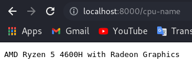
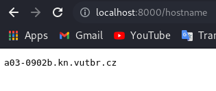
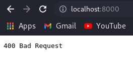

# HTTP server in C (IPK 1 project)

---
author: Anton Medvedev (xmedve04)\
Server provides functionality for processing
those queries:
```
load
cpu-name
hostname
```
## Get started

---
### Compilation
For test functionality you will need to run server. You can do it using 
`make` command for compile C file by Makefile.
### Run
After that you can run the server using
`./hinfosvc port`.\
Port is a number which has length min 4 and max 65000, otherwise program
writes out the error.
## Usage

---
### load
This query writes out current load of your processor. For using you need
to go to `http://localhost:YOUR_PORT/load` web page, and you'll see your 
current processor load.\
\
Or if you prefer to use terminal, you can use this command for get the same result
```
curl http://localhost:YOUR_PORT/load
```
### cpu-name
This query writes out your cpu name. For using you need to go to 
`http://localhost:YOUR_PORT/cpu-name` web page, and you'll see your cpu name.\
\
Or if you prefer to use terminal, you can use this command for get the same result
```
curl http://localhost:YOUR_PORT/cpu-name
```
### host-name
This query writes out a hostname of your system. For using you need to go to
`http://localhost:YOUR_PORT/hostname` web page, and you'll see your hostname.\
\
Or if you prefer to use terminal, you can use this command for get the same result
```
curl http://localhost:YOUR_PORT/hostname
```
### Bad Request
Program can work just with those queries, when you'll try any other query you'll
get a `400 Bad Request` message.\
.
## End

---
### Server stop
For server stop you just need to pres `CTRL + C` in terminal where you started 
the server.

